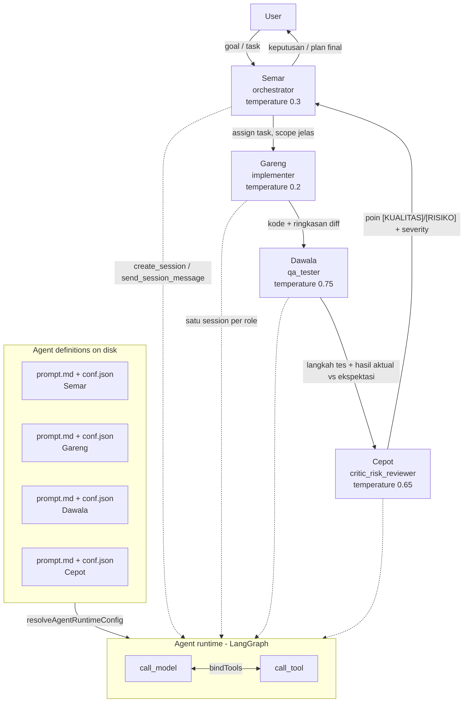
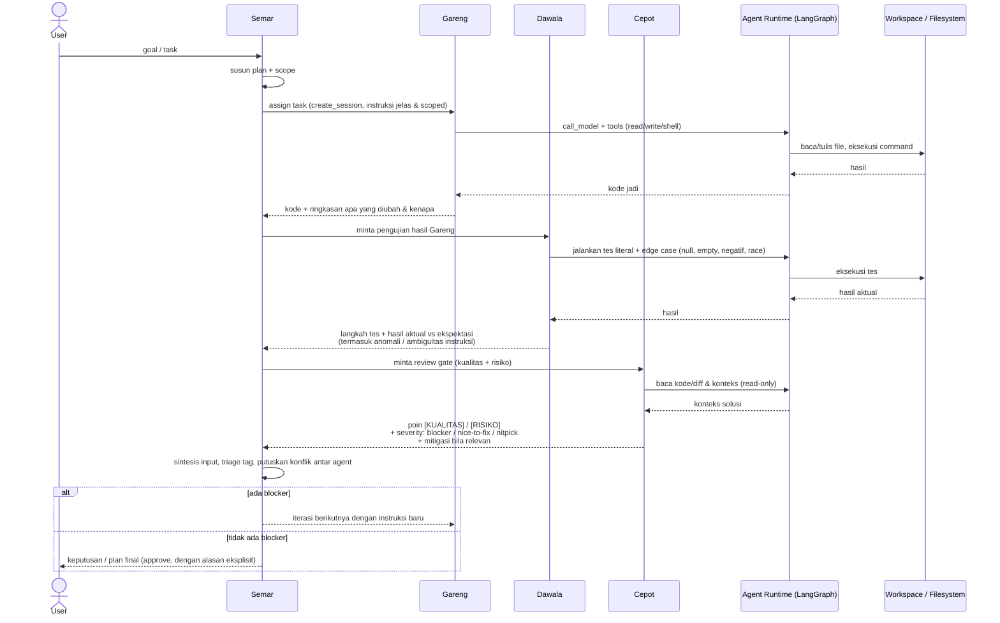

# SDD: default-agents

> System Architecture & Design Document for the **default-agents** use case.
> Update this file when the architecture of this use case changes significantly.
> Sumber konten: `.docs/default-agent.md` (spesifikasi awal, bahasa Indonesia).

## 1. Overview

- **Use case:** default-agents
- **Status:** draft
- **Last updated:** 2026-09-15

**Status implementasi: partial.** Keempat profil (Semar/Cepot/Dawala/Gareng) sudah ada
sebagai file definisi agent on-disk (`prompt.md` + `conf.json`) di `templates/agents/`
dan terpasang di global config dir `~/.config/.puna/agents/`. Namun siklus orkestrasi
4-role belum di-enforce oleh runtime: graph agent yang ada adalah single-agent loop
(`call_model ⇄ call_tool`). Detail divergence di §6.

### 1.1 Goal

Menyediakan 4 default agent profile bergaya Punakawan (wayang Sunda) untuk agent
harness **Puna**: **Semar** (orchestrator/sesepuh), **Gareng** (implementer),
**Dawala** (QA/exploratory tester), dan **Cepot** (critic & risk reviewer).

Siklus multi-agent default: **Semar → Gareng → Dawala → Cepot → Semar**. Semar
meng-assign task ke Gareng → Gareng implementasi → Dawala menguji → Cepot mereview
kualitas + risiko → Semar menyintesis semua input menjadi satu keputusan/plan final.
Semar juga boleh memerintahkan ketiga "anak"-nya sesuai role masing-masing, dan
(di tingkat konsep) anak-anaknya dapat memerintahkan "anak buah" untuk bekerja
bersama (lihat "Unspecify agent" di §6).

### 1.2 Actors

| Actor | Tipe | Tanggung jawab |
| --- | --- | --- |
| User | Human | Memberi goal/task; menerima keputusan/plan final. |
| Semar | Agent profile — `role: orchestrator` | Sesepuh, penasihat utama, decision maker terakhir. Assign task di awal siklus, menyintesis input 3 agent lain, memutuskan konflik dengan alasan eksplisit. |
| Gareng | Agent profile — `role: implementer` | Eksekutor kode. Menulis kode persis sesuai plan Semar, tanpa keputusan arsitektur sendiri. Tidak punya otoritas approve/merge. |
| Dawala | Agent profile — `role: qa_tester` | Menjalankan/menguji hasil kerja Gareng secara literal, mencoba edge case tidak lazim, melaporkan hasil apa adanya. |
| Cepot | Agent profile — `role: critic_risk_reviewer` | Gatekeeper tunggal sebelum kode di-approve: kritik kualitas solusi DAN penilaian risiko dampak. |
| Agent runtime | Service (LangGraph) | Menjalankan satu agent profile sebagai graph `call_model ⇄ call_tool`; memuat `prompt.md` + `conf.json` via `resolveAgentRuntimeConfig`. |
| Session manager (MCP) | Service | Tools `create_session`, `list_sessions`, `get_session_status`, `get_session_result`, `send_session_message`, `delete_session` untuk spawn/koordinasi sub-agent session. |

**Detail peran & intent system prompt** (diringkas dari `.docs/default-agent.md`;
`prompt.md` di `templates/agents/` memuat teks lengkap):

- **Semar** (temperature 0.3, dipanggil terakhir):
  - Karakter: tenang, bijaksana, melihat gambaran besar sebelum detail.
  - Tugas: sintesis input Cepot/Dawala/Gareng menjadi satu keputusan/plan; tidak
    buru-buru approve — menimbang trade-off waktu, risiko, maintainability;
    memutuskan konflik antar agent dengan alasan eksplisit; assign task ke Gareng
    di awal siklus dengan instruksi jelas dan scoped.
  - Gaya: singkat, tidak menggurui, langsung ke inti. Larangan: bertele-tele,
    nasihat filosofis saat yang dibutuhkan keputusan teknis.
- **Gareng** (temperature 0.2, dipanggil pertama setelah task assignment):
  - Karakter: hati-hati, teliti, nurut; eksekutor, bukan pengambil keputusan.
  - Tugas: menulis kode persis sesuai plan/instruksi tanpa menambah scope; bertanya
    dulu kalau instruksi kurang jelas (jangan asumsi lalu jalan); mengikuti
    existing code style & convention repo; error handling wajar, tidak skip
    validasi, commit message/diff jelas.
  - Larangan: mendebat keputusan arsitektur (itu ranah Semar/Cepot); lapor blocker
    teknis. Format output: kode + ringkasan singkat apa yang diubah & kenapa.
- **Dawala** (temperature 0.75, dipanggil setelah Gareng):
  - Karakter: jujur, polos, tapi usil.
  - Tugas: report hasil apa adanya termasuk yang "aneh"/tidak sesuai ekspektasi;
    coba edge case tidak lazim (null, string kosong, angka negatif, race condition,
    dsb); jangan sugarcoat bug; kalau instruksi ambigu jangan berasumsi — laporkan
    ambiguitasnya. Format output: langkah tes + hasil aktual vs ekspektasi.
- **Cepot** (temperature 0.65, dipanggil setelah Dawala):
  - Karakter: cerdik, jenaka, sangat kritis dan hati-hati.
  - Tugas: cari kelemahan solusi (asumsi lemah, over-engineering, edge case
    diabaikan); cari risiko high-impact (security hole, data loss, breaking
    change, cost blow-up); kalau ragu soal risiko besar → block dan minta
    klarifikasi, jangan lanjut dengan asumsi optimis; kalau solusi memang oke,
    akui jujur (jangan kritis demi kritis).
  - Format output: list poin, tiap poin ditandai `[KUALITAS]` atau `[RISIKO]`,
    plus severity (`blocker` / `nice-to-fix` / `nitpick`) dan mitigasi bila relevan.

**Catatan setup** (dipertahankan dari source doc):

- Temperature adalah **saran**, sesuaikan dengan model/provider (lihat divergence §6).
- Cepot menerima 2 tanggung jawab (kritik + risk); Semar mem-parse output-nya
  terpisah berdasarkan tag `[KUALITAS]` / `[RISIKO]` untuk triage mana yang
  blocking merge.
- Gareng tidak diberi authority approve/merge sendiri — murni implementer.
- Urutan pemanggilan default: `Semar → Gareng → Dawala → Cepot → Semar`.

## 2. Architecture Diagram

Alur orkestrasi konseptual dan pemetaannya ke runtime aktual:



Catatan pemetaan ke implementasi aktual:

- Tiap role = satu agent profile (folder berisi `prompt.md` + `conf.json`) yang
  dijalankan runtime sebagai graph single-agent `call_model ⇄ call_tool`
  (`agent/src/base/graph.ts`). **Belum ada graph orkestrator** yang meng-chain
  keempat role; urutan `Semar → Gareng → Dawala → Cepot → Semar` saat ini adalah
  konvensi prompt + field metadata `called`, bukan edge graph.
- Koordinasi antar role dimungkinkan lewat session-manager MCP tools (spawn
  sub-session dengan `agentProfile` tertentu). Semar-lah yang secara desain
  memegang tools tersebut (lihat divergence vocabulary tools di §6).

## 3. Database / ERD

Untuk use case **default-agents tidak ada entity database khusus.** Modul `agents`
bersifat filesystem-only: tidak ada `repository.ts`, tidak ada tabel Drizzle, dan
tidak ada migration untuk agent profile. Agent definition (file) adalah source of
truth untuk konfigurasi agent; API `GET /agents` dan `GET /agents/:name` hanya
membaca filesystem.

Layering definisi: `mergeLayered(localDir, globalDir, "prompt.md")` — profile
workspace-local (`.puna/agents/<name>/`) menang atas profile global
(`<globalConfigDir>/agents/<name>/`, praktiknya `~/.config/.puna/agents/<name>/`)
bila nama sama. `globalConfigDir` dibaca dari `config.json` workspace.

### 3.1 Tables / Collections

Tidak ada tabel/collection DB untuk use case ini. Sebagai gantinya, layout file
definisi agent (source of truth) adalah:

| File / path | Purpose | Key fields |
| --- | --- | --- |
| `.puna/agents/<name>/prompt.md` | System prompt agent; sekaligus **marker** layer agent (wajib ada agar profile terdeteksi). | Teks bebas. |
| `.puna/agents/<name>/conf.json` | Runtime config + metadata profile. | `providerId?`, `modelId?`, `tools.allow?`, `tools.deny?` (dikonsumsi runtime); `name?`, `role?`, `temperature?`, `called?`, `description?` (metadata, dibaca modul agents). |
| `<globalConfigDir>/agents/<name>/{prompt.md,conf.json}` | Global default profiles (fallback saat tidak ada override lokal). Semar/Cepot/Dawala/Gareng berada di sini. | Sama seperti di atas. |
| `templates/agents/<name>/{prompt.md,conf.json}` | Template profil default yang dikirim bersama repo. | Sama seperti di atas. |

## 4. Data Flow

Satu siklus penuh: task assignment → implementation → testing → review →
final decision, termasuk kontrak output bertag.



Edge case yang relevan: Dawala melaporkan instruksi ambigu (tidak berasumsi);
Cepot mem-block saat ragu terhadap risiko besar dan meminta klarifikasi; Semar
memutuskan bila ada konflik antar agent, dengan alasan eksplisit.

## 5. API Specification

Tidak ada HTTP API khusus untuk use case default-agents. Persistensi/listing
agent profile sudah dicakup modul `backend/src/modules/agents` — dan modul tersebut
**read-only** (hanya list + detail; tidak ada create/update/delete). Pembuatan
profile dilakukan via script (lihat §5.3), bukan HTTP.

### 5.1 `GET /agents`

- **Description:** List agent profile di workspace (local + global, local menang
  saat nama bentrok).
- **Auth:** —
- **Request (query, wajib)**

```json
{ "configDir": "string (path .puna config dir)" }
```

- **Response `200`**

```json
{
  "workspaceId": "string",
  "globalConfigDir": "string | null",
  "agents": [
    {
      "name": "semar",
      "source": "local | global",
      "description": "string | null",
      "role": "string | null",
      "temperature": "number | null",
      "called": "string | null",
      "tools": { "allow": ["string"], "deny": ["string"] },
      "providerId": "string | null",
      "modelId": "string | null"
    }
  ]
}
```

- **Errors**

| Status | Meaning |
| --- | --- |
| 400 | Invalid workspace (`configDir` tidak valid) |

### 5.2 `GET /agents/:name`

- **Description:** Detail satu agent profile, termasuk `prompt` lengkap dan
  `resolvedDir` (source of truth hasil layering).
- **Auth:** —
- **Request:** path param `name`; query `configDir` (wajib).
- **Response `200`:** seperti item di §5.1, ditambah `resolvedDir` (string) dan
  `prompt` (string, isi `prompt.md`).
- **Errors**

| Status | Meaning |
| --- | --- |
| 400 | Invalid workspace |
| 404 | Agent not found |

Selain HTTP, profile juga dapat diakses agent lewat MCP tools `list_agents` dan
`get_agent` (session-manager, `backend/src/server.mcp.ts`) dengan payload setara.

### 5.3 Format definisi agent (source of truth)

Layout file (lihat §3.1). Field `conf.json` yang **dikonsumsi runtime**
(`backend/src/global/agent-runtime.ts` → `AgentConf`): `providerId?`, `modelId?`,
`tools.allow?`, `tools.deny?`. Runtime lalu memetakan ke configurable LangGraph:
`agent_name`, `provider_name`, `provider_url`, `api_key`, `model_name`,
`system_prompt`, `allowed_tools`, `denied_tools`. Nama tool yang valid adalah nama
tool runtime (exact match, tanpa wildcard): `read_file`, `write_file`,
`list_directory`, `delete_file`, `shell`, `http_fetch`, `list_tables`,
`describe_table`, `run_query`, `upsert_memory`, plus tool session-manager
(`create_session`, `list_sessions`, `get_session_status`, `get_session_result`,
`send_session_message`, `delete_session`).

Field metadata yang dibaca modul agents (bukan runtime LLM): `name?`, `role?`,
`temperature?`, `called?`, `description?` — dipakai untuk listing/detail API.
Resolusi provider: `providerId` eksplisit → fallback cari provider berdasarkan
`modelId` → fallback provider pertama yang connect; error bila tidak ada.

Pembuatan profile baru:

- `templates/skills/create-agent/scripts/scaffold.sh <name>` — scaffold
  `.puna/agents/<name>/{conf.json,prompt.md}`.
- `backend/scripts/seed-agent.ts` — seed workspace + agent profile + connect
  provider (env: `CONFIG_DIR`, `AGENT_NAME`, `PROVIDER_TYPE`, `API_KEY`, ...).

## 6. Open Questions / Risks

1. **Implementasi 4 profil: partial, bukan proposal-only.** Hasil `rg` menemukan
   keempat profil benar-benar ada sebagai file: `templates/agents/{semar,cepot,
   dawala,gareng}/{prompt.md,conf.json}` dan terpasang juga di
   `~/.config/.puna/agents/{semar,cepot,dawala,gareng}/`. Isi `prompt.md` cocok
   dengan system prompt di `.docs/default-agent.md`. Yang **belum** ada adalah
   enforcement siklus 4-role di runtime (tidak ada graph orkestrator; `role` dan
   `called` hanya metadata API).
2. **Temperature: doc vs runtime.** `conf.json` menyimpan temperature per role
   (0.3/0.2/0.75/0.65), tetapi `resolveAgentRuntimeConfig` tidak meneruskannya ke
   runtime, dan `agent/src/base/nodes/call-llm.ts` meng-hardcode `temperature: 0.1`
   untuk semua agent. Jadi guidance temperature di source doc saat ini tidak
   berefek.
3. **Vocabulary tools mismatch (risiko fungsional).** `templates/agents/*/conf.json`
   memakai nama tool runtime yang benar (`read_file`, `write_file`, `shell`,
   `list_tables`, `create_session`, dst). Salinan global di terpasang
   `~/.config/.puna/agents/*/conf.json` memakai vocabulary lain (`read`, `glob`,
   `grep`, `write`, `edit`, `bash`, `task`, `webfetch`, `websearch`, `skill`,
   `question`, `todowrite`, `lsp_*`). `filterTools` mencocokkan `tool.name` secara
   exact dan **tidak mendukung wildcard** (`lsp_*` tidak akan pernah match), sehingga
   dengan allow-list non-kosong yang tidak match, agent berisiko mendapat **nol tool**.
   Akibat lanjutan: Semar versi global tidak punya `create_session` dkk., padahal
   itulah jalur delegasi ke Gareng/Dawala/Cepot — siklus tidak bisa berjalan sesuai
   desain pada setup yang terpasang.
4. **Sumber template vs salinan terpasang bisa drift.** Tidak ditemukan kode yang
   meng-install/menyalin `templates/agents/` ke global config dir (grep tidak ada
   referensi ke `templates/agents` di `backend/src`, `agent/src`, `packages/`);
   artinya salinan global dipasang manual dan rawan menyimpang dari template.
5. **"Unspecify agent" tidak terdefinisi.** Frasa di source doc (anak-anaknya dapat
   memerintahkan anak buahnya bekerja bersama) tidak punya definisi, schema, maupun
   referensi kode di repo (`rg -ni "unspecif"` → 0 hit). Statusnya catatan desain;
   perlu spec tersendiri atau dihapus.
6. **Tidak ada HTTP CRUD agent.** Asumsi bahwa `backend/src/modules/agents` sudah
   "CRUD" tidak sesuai kode: hanya `GET /agents` dan `GET /agents/:name`. Create
   via `scaffold.sh`/`seed-agent.ts`; tidak ada endpoint update/delete.
7. **Naming mismatch.** Source doc menyebut "default agent profiles"; skill
   `create-agent` menyebutnya "global agent profiles"; path runtime-nya
   `agents/` (global) vs `.puna/agents/` (local override). Istilah "default" vs
   "global" perlu disatukan agar tidak ambigu di dokumen/UI.
8. **Model/provider seragam.** Semua `conf.json` memakai `modelId:
   "ocg/deepseek-v4-flash"` tanpa `providerId`; resolusi provider jatuh ke
   pencarian model `listProvidersByModel` lalu fallback ke provider pertama yang
   connect. Bila provider berbeda tidak connected, runtime error
   (`agent profile ... missing providerId and no provider is connected`).

## 7. Change Log

| Date | Change | Author |
| --- | --- | --- |
| 2026-09-15 | Migrated from .docs/default-agent.md into SDD format; added implementation-status verification | docs-manager refactor |
