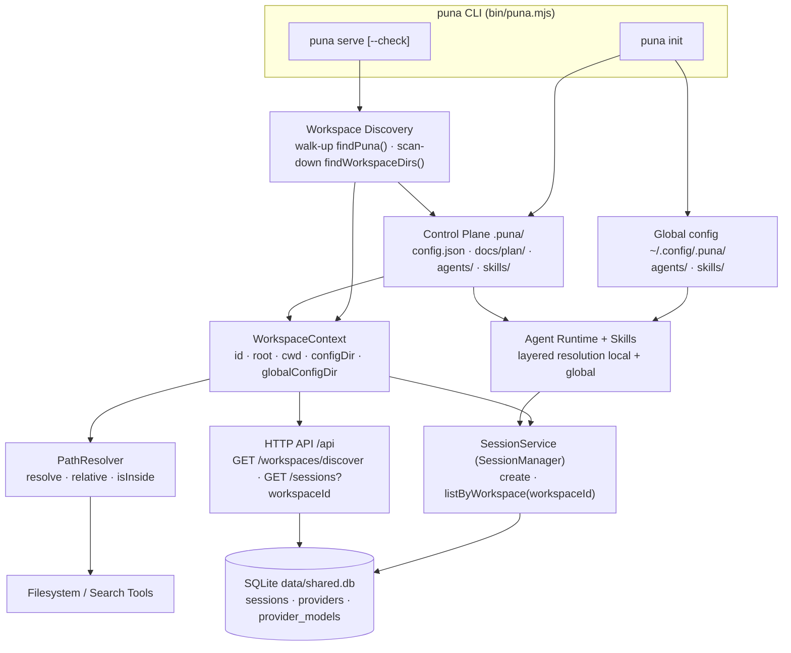
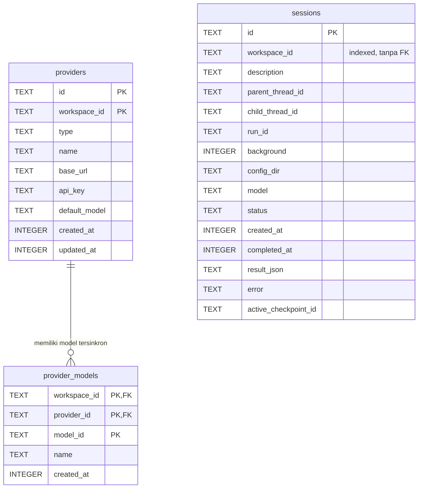
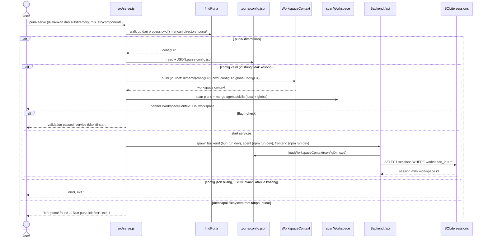

# SDD: workspace

> System Architecture & Design Document for the **workspace** use case.
> Update this file when the architecture of this use case changes significantly.

## 1. Overview

- **Use case:** workspace
- **Status:** draft
- **Last updated:** 2026-09-15

### 1.1 Goal

Workspace adalah konteks project tempat Coding Agent `puna` bekerja: ia memberi **persistent identity** (`workspace.id`) yang tidak bergantung pada lokasi directory, sebuah **project-local control plane** `.puna/` yang menyimpan konfigurasi, planning artifacts, agent definitions, dan skills, serta mekanisme **discovery runtime** sehingga project dapat dipindahkan tanpa kehilangan session dan history.

### 1.2 Actors

| Actor | Peran |
| --- | --- |
| User / Developer | Membuat dan menjalankan workspace melalui `puna init` dan `puna serve`. |
| puna CLI (`bin/puna.mjs`) | Global executable; dispatch command `init` dan `serve`. |
| Workspace Discovery | `findPuna()` di `src/serve.js` (walk-up dari `cwd`) dan `findWorkspaceDirs()` di `backend/src/global/workspace-scanner.ts` (scan-down dari sebuah root) untuk menemukan `.puna/`. |
| WorkspaceContext | Objek runtime representasi workspace aktif (`backend/src/global/workspace-context.ts`); satu sumber kebenaran untuk `id`, `root`, `cwd`, `configDir`, `globalConfigDir`. |
| PathResolver | Basis path untuk filesystem/search tools (`backend/src/global/path-resolver.ts`). |
| Agent Runtime + Skills | Memuat agent definitions (`prompt.md` + `conf.json`) dan skills (`desc.md` + `scripts/`) dari layer local dan global. |
| SessionService (konsep `SessionManager`) | Membuat/melisting session berdasarkan `workspace_id`; dipakai oleh REST `/api/sessions` dan MCP tools. |
| SQLite | Menyimpan state persisten (`sessions`, `providers`, `provider_models`); workspace sendiri tidak disimpan di sini. |
| HTTP / MCP client | Frontend dan proses `agent/` mengakses `/api/*` serta `/mcp`. |

### 1.3 Design Principles

1. **Global executable, local workspace** — instalasi `puna` bersifat global, sedangkan konfigurasi dan artifacts bersifat project-local (`.puna/`). Lokasi instalasi tidak menentukan workspace.
2. **`cwd` bukan `root`** — `cwd` adalah tempat command dijalankan, `root` adalah root project; keduanya direpresentasikan terpisah.
3. **Identity ≠ Location** — `workspace.id` adalah persistent identity; `workspace.root` adalah lokasi project saat ini; `workspace.cwd` adalah lokasi invocation. Directory dapat berubah tanpa mengubah identity.
4. **Filesystem adalah source of truth untuk workspace** — `.puna/config.json` menyimpan identity dan konfigurasi; workspace tidak perlu diregistrasikan ke database untuk penggunaan normal.
5. **Database menyimpan state, bukan workspace filesystem** — Session, Message, Task, Tool Call, dan Execution History disimpan di database dan dihubungkan ke workspace melalui `workspace_id`.
6. **`.puna/` adalah project-local control plane** — menyimpan configuration, planning, agent definitions, dan skills; sebaiknya version-controlled bersama project, tetapi credential/API key/token tidak boleh disimpan di dalamnya.
7. **`process.cwd()` hanya digunakan pada boundary** — jangan menganggap `process.cwd()` sebagai project root di berbagai bagian codebase. Alurnya: CLI → Workspace Discovery → WorkspaceContext → Application, sehingga semua komponen memakai satu sumber kebenaran workspace aktif.

### 1.4 Control Plane `.puna/`

Layout yang dihasilkan/dipakai saat ini:

```text
my-project/
├── .git/
├── src/
├── package.json
│
└── .puna/
    ├── config.json          # workspace identity + referensi global config
    ├── .gitignore           # config.local.json, cache/, *.log
    ├── README.md
    │
    ├── docs/
    │   └── plan/
    │       ├── <plan-name>.md
    │       └── <plan-name>.progress.md
    │
    ├── agents/              # optional local override (tidak auto-created)
    │   └── <agent-name>/
    │       ├── prompt.md
    │       └── conf.json
    │
    └── skills/              # optional local override (tidak auto-created)
        └── <skill-name>/
            ├── desc.md
            └── scripts/
                ├── <script-name>.js
                └── <script-name>.py
```

**Planning artifacts** berada di `.puna/docs/plan/`. File `<plan-name>.md` adalah source of truth untuk rencana pekerjaan (objective, requirements, architecture, implementation steps, acceptance criteria) dan sebaiknya tidak berubah bebas selama execution kecuali ada replanning. File `<plan-name>.progress.md` menyimpan execution progress, misalnya checklist `[x]`/`[ ]`. Plan dan progress adalah filesystem artifacts, bukan database state utama.

**Agent definitions** berada di `.puna/agents/<name>/`: `prompt.md` mendefinisikan behavior/role agent, sedangkan `conf.json` mendefinisikan runtime configuration agent (mis. `model` dan daftar `tools`). **Skills** berada di `.puna/skills/<name>/`: `desc.md` menjelaskan capability dan cara penggunaannya, sedangkan `scripts/` berisi executable scripts (JavaScript/Python) yang dapat dipanggil agent. Perbedaan peran: **Agent = who is performing the task; Skill = what capability is available**; satu skill dapat dipakai banyak agent.

Resolver bersifat layered: nama yang sama di `.puna/agents|skills/` (local override) menang atas global default di `~/.config/.puna/agents|skills/`; nama yang berbeda dari keduanya sama-sama dimuat (additive).

### 1.5 Identity, Discovery, dan Session

`config.json` menyimpan persistent identity workspace. Contoh bentuk yang dihasilkan `puna init` saat ini:

```json
{
  "id": "ws_01K7ABC123XYZ",
  "version": 1,
  "globalConfigDir": "/home/<user>/.config/.puna"
}
```

`id` dibuat dengan format `ws_` + ULID (26 karakter Crockford base32, sortable berdasarkan waktu). Karena identity tidak bergantung pada absolute filesystem path, project yang dipindah dari `/home/aldi/Documents/my-project` ke `/home/aldi/Projects/my-project` tetap memakai `id` yang sama, sehingga session lama tetap relevan saat agent dijalankan kembali di lokasi baru.

`WorkspaceContext` adalah objek runtime workspace aktif:

```ts
interface WorkspaceContext {
  id: string;
  root: string;
  cwd: string;
  configDir: string;
  globalConfigDir: string | null;
}
```

- `id` — persistent workspace identity; dipakai untuk menghubungkan workspace dengan sessions, conversations, tasks, history, dan execution state.
- `root` — root directory project, ditemukan melalui discovery; `root = dirname(configDir)`.
- `cwd` — directory tempat user menjalankan Coding Agent (contoh: `cwd = ~/Documents/my-project/src/components`, `root = ~/Documents/my-project`).
- `configDir` — directory `<root>/.puna`.
- `globalConfigDir` — opsional; lokasi global config (`~/.config/.puna`), null bila tidak tercantum/valid di `config.json`.

`SessionService` (konsep yang di source doc disebut `SessionManager`) tidak perlu mengetahui absolute filesystem path: session menyimpan `workspace_id`, dan lookup dilakukan dengan `WHERE workspace_id = ?`. Dengan demikian session tetap konsisten meski filesystem location berubah. Tanggung jawabnya: membuat session baru (mengisi `workspace_id` dan `configDir`), melisting/mengambil session per workspace (terurut), serta mengelola status/result/cancel/delete untuk eksekusi agent.

## 2. Architecture Diagram



Catatan: `puna serve` sendiri hanya melakukan discovery, memuat context, dan men-scan isi workspace (plans/agents/skills), lalu men-start service `backend`, `agent`, dan `frontend`; lookup session by `workspace_id` terjadi di service backend (REST/MCP) yang berjalan di atas SQLite.

## 3. Database / ERD

Workspace **bukan** entity database untuk penggunaan normal: tidak ada tabel `workspaces`. Filesystem (`.puna/config.json`) adalah source of truth, dan database menyimpan state yang mereferensikan workspace via kolom `workspace_id`.



Keterangan:

- `sessions.workspace_id` adalah `TEXT NOT NULL` dengan index `sessions_workspace_idx`; **tidak ada foreign key** ke workspace mana pun (tidak ada tabel targetnya). Nilainya mengacu ke `id` di `.puna/config.json`.
- `providers` memakai PK komposit `(id, workspace_id)`. Provider dengan `workspace_id = "__global__"` (`GLOBAL_WORKSPACE_ID`) visible untuk semua workspace; row local men-shadow row global.
- `provider_models` memakai PK `(workspace_id, provider_id, model_id)` dan FK komposit `(workspace_id, provider_id)` ke `providers(workspace_id, id)` dengan `ON DELETE CASCADE`.
- SQLite dan schema Drizzle: dialect `sqlite`, schema glob `backend/src/models/*.ts`, default DB path `data/shared.db` (relatif ke `backend/`), dapat dioverride lewat env `SQLITE_PATH` atau `BACKEND_DB_PATH`; DB dipakai bersama proses `agent/`.

### 3.1 Tables / Collections

| Name | Purpose | Key fields |
| --- | --- | --- |
| `sessions` | State eksekusi session/run per workspace; menyimpan `workspace_id` dan `config_dir`, bukan absolute filesystem path sebagai identity. | `id` (PK), `workspace_id` (NOT NULL, indexed), `description`, `parent_thread_id`, `child_thread_id`, `run_id`, `background`, `config_dir`, `model`, `status`, `created_at`, `completed_at`, `result_json`, `error`, `active_checkpoint_id` |
| `providers` | Konfigurasi provider LLM per workspace (atau global via sentinel `__global__`). `api_key` disimpan server-side dan tidak pernah dikembalikan API (hanya masked preview). | `id` + `workspace_id` (PK komposit), `type`, `name`, `base_url`, `api_key`, `default_model`, `created_at`, `updated_at` |
| `provider_models` | Daftar model hasil sinkronisasi milik sebuah provider per workspace. | `workspace_id` + `provider_id` + `model_id` (PK komposit), `name`, `created_at`, FK komposit cascade ke `providers` |

## 4. Data Flow

### 4.1 `puna init` — membuat `.puna/`

```mermaid
sequenceDiagram
    actor U as User
    participant CLI as puna CLI
    participant INIT as src/init.js
    participant G as Global config
    participant FS as Filesystem

    U->>CLI: puna init
    CLI->>INIT: init(args)
    INIT->>G: ensureGlobal()
    alt global config belum ada
        INIT->>FS: copy templates/agents + templates/skills ke global config dir (agents: semar, cepot, dawala, gareng; skills: create-agent, create-skill, planning)
    else global config sudah ada
        Note over INIT,G: dipakai apa adanya
    end
    alt argumen --global
        INIT-->>U: selesai (hanya bootstrap global config, idempotent)
    else init workspace lokal
        INIT->>FS: cek .puna/ di cwd
        alt .puna/ sudah ada dengan config.json valid
            INIT->>FS: refresh field globalConfigDir (idempotent)
        else .puna/ ada tetapi config.json hilang atau JSON invalid
            INIT-->>U: abort dengan error, exit 1
        else .puna/ belum ada
            INIT->>FS: mkdir .puna/docs/plan/
            INIT->>FS: tulis .puna/config.json berisi id "ws_" + ULID, version, globalConfigDir
            INIT->>FS: tulis .puna/.gitignore dan .puna/README.md
        end
        INIT-->>U: workspace_id, global_config, next steps (buat plan, optional local override, jalankan puna serve)
    end
```

Edge cases:

- `puna init` **tidak** membuat `.puna/agents/` dan `.puna/skills/`; keduanya hanya dibuat manual bila ingin override local. Yang dibuat hanyalah `docs/plan/`.
- `puna init --global` hanya menyiapkan global config dan idempotent (skip bila sudah ada).
- Bila `.puna/` sudah ada tetapi `config.json` hilang, init abort (tidak menimpa dan tidak menebak identity).

### 4.2 `puna serve` — discovery dan session lookup



Edge cases dan catatan:

- Discovery tidak menganggap `process.cwd()` sebagai root; ia menaiki parent directory sampai `.puna/` pertama ditemukan. Ini yang membuat `puna serve` bisa dijalankan dari subdirectory mana pun.
- `puna serve` memerlukan full harness repo (directory `agent/`, `backend/`, `frontend/` sebagai sibling); setelah `npm i -g`, hanya CLI yang ter-ship dan serve akan menolak start dengan instruksi clone/`npm link`.
- `--check` (alias `-c`) hanya memvalidasi workspace lalu berhenti tanpa menyentuh service.
- CLI `src/serve.js` hanya memvalidasi `id`; backend `loadWorkspaceContext` juga mewajibkan `version` bertipe number.
- Project yang dipindah: discovery di lokasi baru membaca `config.json` dan mendapatkan `workspace.id` yang sama, lalu backend mencari session lama dengan `workspace_id` tersebut — session tetap relevan meski absolute path berubah.
- Scan isi workspace bersifat read-only dan menggabungkan layer local/global dengan aturan local menang saat nama sama.

## 5. API Specification

### 5.1 CLI Commands

| Command | Behavior |
| --- | --- |
| `puna init` | Membuat `.puna/` di `process.cwd()` (bukan walk-up): bootstrap global config bila belum ada, buat `docs/plan/`, tulis `config.json` (`id`, `version`, `globalConfigDir`), `.gitignore`, dan `README.md`. Idempotent: bila `.puna/` sudah ada, hanya me-refresh `globalConfigDir`. Exit 1 bila `.puna/` ada tanpa/invalid `config.json`. |
| `puna init --global` | Hanya bootstrap global config di `~/.config/.puna/` (agents: `semar`, `cepot`, `dawala`, `gareng`; skills: `create-agent`, `create-skill`, `planning`) dari `templates/`; idempotent. |
| `puna serve` | Walk-up dari `cwd` mencari `.puna/`, memuat WorkspaceContext, men-scan plans/agents/skills, mencetak banner, lalu men-spawn 3 service dari repo root: backend (`bun run dev`), agent (`npm run dev`), frontend (`npm run dev`). Exit 1 bila `.puna/` tidak ditemukan, config invalid, atau komponen service tidak lengkap. |
| `puna serve --check` (`-c`) | Sama seperti `serve` sampai validasi, lalu berhenti tanpa start service. |
| `puna -h` / `--help` | Mencetak help. Help text juga menyebut `puna help`, tetapi switch saat ini tidak menangani `help` (jatuh ke unknown command → exit 1). |
| `puna <unknown>` | Error `Unknown command: <cmd>`, cetak help, exit 1. |

### 5.2 HTTP API

#### 5.2.1 `GET /api/workspaces/discover`

- **Description:** Scan rekursif sebuah root untuk menemukan directory `.puna/` (workspace). Kandidat ditemukan lewat `findWorkspaceDirs()` dengan `maxDepth = 10`, melewati symlink, directory hidden, denylist (mis. `node_modules`, `.git`, `dist`, `build`, `.venv`), dan tidak menurun ke dalam workspace yang sudah ditemukan. `id` setiap workspace dibaca opsional dari `config.json`.
- **Auth:** Tidak ada middleware auth yang terlihat di route ini.
- **Request:** Query parameter `root` (string, optional; di-expand `~`; default `~`/homedir). **Tidak ada request body** (GET, query-only).

```json
{}
```

- **Response `200`:**

```json
{
  "root": "/home/user",
  "workspaces": [
    { "path": "/home/user/projects/my-project/.puna", "id": "ws_01K7ABC123XYZ" },
    { "path": "/home/user/labs/scratch/.puna", "id": null }
  ]
}
```

`id` bertipe `string | null` — `null` bila `config.json` hilang atau `id` tidak valid.

- **Errors:**

| Status | Meaning |
| --- | --- |
| 500 | Scan failed, body `{ "error": "<message>" }` |

#### 5.2.2 Endpoint terkait (di luar modul `workspaces`)

`GET /api/sessions?workspaceId=<id>` di `backend/src/modules/sessions/route.ts` memfilter session berdasarkan workspace; response array summary `{ id, workspaceId, description, status, createdAt, completedAt? }`. Endpoint ini adalah konsumen utama `workspace_id` di runtime (REST dan MCP memakai service yang sama).

## 6. Open Questions / Risks

- **Nama legacy `.nusa/`.** Source doc `.docs/workspace-architecture.md` memakai `.nusa/` (dan executable `nusa`); code saat ini memakai `.puna/` dan CLI `puna`. Semua referensi di dokumen ini sudah dimigrasikan; jangan mengikuti contoh `.nusa/` di source doc.
- **Nama file config agent tidak konsisten.** Source doc menyebut `agents/<name>/config.json`; `templates/agents/*/` berisi `conf.json`, dan `src/init.js` (`copyAgentTemplate`) menyalin `conf.json`. `.puna/README.md` yang ter-commit juga menulis `conf.json`. Nama yang benar saat ini adalah `conf.json`.
- **README `.puna/` ada dua versi.** `.puna/README.md` di repo menyebut `config.json` = "workspace id + cwd" dan agent `conf.json`; README yang di-generate `src/init.js` menyebut "workspace id + global config reference" dan agents/skills sebagai local override opsional. Perlu diselaraskan dan diputuskan mana yang canonical.
- **Field `config.json` tidak konsisten.** `src/init.js` hanya menulis `id`, `version`, `globalConfigDir`, tetapi `.puna/config.json` yang ter-commit memiliki `cwd` dan `createdAt` tambahan. `loadWorkspaceContext` mengabaikan keduanya (hanya memvalidasi `id` + `version`), sehingga `cwd`/`createdAt` saat ini tidak terpakai dan berpotensi stale setelah project dipindah.
- **Format `id` bercampur.** `workspaceId()` menghasilkan `ws_` + ULID, tetapi `.puna/config.json` yang ter-commit memakai UUID (`4b23a80e-...`). Validasi hanya mengecek string non-kosong, jadi keduanya diterima — tidak ada migrasi/kanonisasi format.
- **Workspace bukan entity DB.** Tidak ada tabel `workspaces`; `sessions.workspace_id` adalah plain `TEXT` tanpa FK. Konsekuensi: tidak ada deduplikasi/validasi id di level database, copy-paste `.puna/` ke project lain menghasilkan dua workspace dengan `id` sama, dan integritas `workspace_id` sepenuhnya bergantung pada layer aplikasi.
- **Dua arah discovery dengan semantik berbeda.** `puna serve` walk-up dan berhenti di `.puna/` pertama (first match); endpoint discover scan-down, `maxDepth 10`, skip symlink/hidden dir/denylist, dan tidak menurun ke workspace yang sudah ditemukan. Workspace yang lebih dalam dari depth 10 atau di bawah directory hidden tidak akan ditemukan oleh endpoint; symlink `.puna/` tidak diikuti.
- **Global config dir tidak konsisten.** `init`/`WorkspaceContext` memakai `~/.config/.puna`, sedangkan plugin system-global memakai `defaultSystemPluginDir()` = `~/.config/puna` (tanpa dot). Dua lokasi berbeda untuk konsep "global" berpotensi membingungkan.
- **`PathResolver` belum ter-wire.** `PathResolver` (`resolve`, `relative`, `isInside`) ada dan teruji, tetapi belum dipakai oleh production code; `isInside` menyediakan boundary check, namun `resolve()` sendiri tidak menegakkan batas root — caller harus mengecek `isInside` jika ingin mencegah path traversal.
- **SessionManager → SessionService.** Nama/desain di source doc (`SessionManager` dengan `create()`/`list()`) diimplementasikan sebagai `SessionService` + `sessions/repository.ts` (`listByWorkspace`, index `sessions_workspace_idx`), dengan surface REST dan MCP (tools session di `backend/src/server.mcp.ts`). Tidak ada class bernama `SessionManager` di code.
- **`puna help` tidak ditangani.** Help text mencetak `puna help`, tetapi `bin/puna.mjs` tidak punya case `help`; command tersebut berakhir sebagai unknown command dengan exit 1.
- **Portabilitas config.** `.puna/config.json` menyimpan `globalConfigDir` absolute (mis. `/home/aldi-rudexylo/.config/.puna`). Bila `.puna/` di-commit dan dipakai user lain, path ini menunjuk ke home directory user lain sampai `puna init` me-refresh-nya.
- **Plan/progress bukan database state.** `.puna/docs/plan/` adalah filesystem artifacts; tidak ada sinkronisasi/validasi antara plan dan state session di SQLite.

## 7. Change Log

| Date | Change | Author |
| --- | --- | --- |
| 2026-09-15 | Migrated from `.docs/workspace-architecture.md` into SDD format; updated `.nusa` → `.puna` to match current code | docs-manager refactor |
